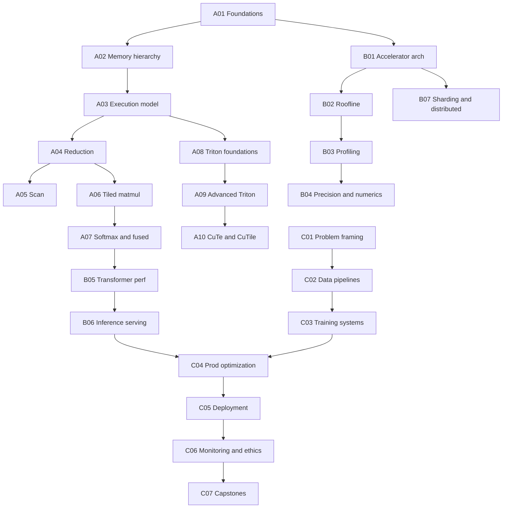
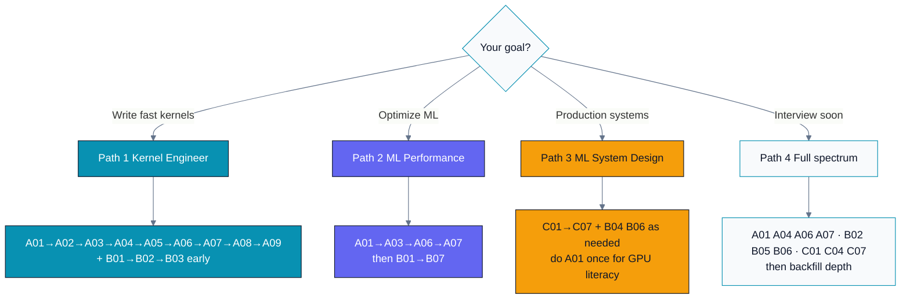
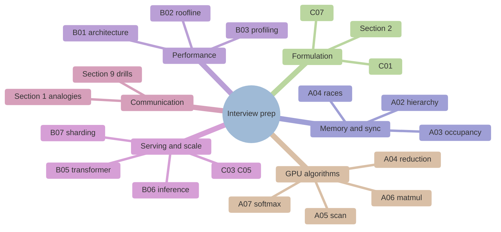

# Curriculum — Module Index & Progress Tracker

This is the master index for the GPU + ML Expert Tutor. It lists every planned module, the
dependencies between them, recommended learning paths, and a live progress + effort tracker.

Modules are built **incrementally and just-in-time**: a module folder is created only when we
build it, to avoid empty-folder clutter. Status below tells you what exists today.

---

## Legend

- **Status**: `DONE` (fully built to template) · `DRAFT` (partial) · `PLANNED` (not yet created)
- **Est. hours**: rough learner time to work through the module (read + labs + drills).
- **Depth**: prerequisite depth — how much prior GPU knowledge it assumes (1 = none, 5 = deep).

---

## Dependency graph

---

## Track A — GPU Programming Languages

| ID | Module | Status | Est. hours | Depth |
|----|--------|--------|-----------:|:-----:|
| A01 | Foundations & programming model | **DONE** | 6 | 1 |
| A02 | Memory hierarchy & coalescing | **DONE** | 6 | 2 |
| A03 | Execution model: warps/wavefronts, occupancy, divergence | PLANNED | 7 | 2 |
| A04 | Parallel reduction (7-stage optimization) | PLANNED | 6 | 3 |
| A05 | Parallel scan / prefix sum (Blelloch) | PLANNED | 6 | 3 |
| A06 | Tiled matmul (shared-memory tiling) | PLANNED | 8 | 3 |
| A07 | Softmax & fused kernels (online softmax) | PLANNED | 7 | 4 |
| A08 | Triton foundations | PLANNED | 6 | 3 |
| A09 | Advanced Triton (autotuning, FlashAttention-style) | PLANNED | 9 | 4 |
| A10 | CuTe / CUTLASS / CuTile (NVIDIA-only, optional) | PLANNED | 10 | 5 |

## Track B — GPU Understanding & ML Performance

| ID | Module | Status | Est. hours | Depth |
|----|--------|--------|-----------:|:-----:|
| B01 | Accelerator architecture (CDNA vs Hopper) | PLANNED | 6 | 2 |
| B02 | Roofline model & arithmetic intensity | PLANNED | 5 | 2 |
| B03 | Profiling (`rocprofv3` / Nsight) | PLANNED | 6 | 3 |
| B04 | Precision & numerics (fp32→fp8, quantization) | PLANNED | 6 | 3 |
| B05 | Transformer architecture from a perf lens | PLANNED | 7 | 4 |
| B06 | Inference serving optimizations | PLANNED | 8 | 4 |
| B07 | Model sharding & distributed | PLANNED | 8 | 4 |

## Track C — ML System Design

| ID | Module | Status | Est. hours | Depth |
|----|--------|--------|-----------:|:-----:|
| C01 | Problem framing, metrics & decomposition | PLANNED | 5 | 1 |
| C02 | Data pipelines & feature engineering | PLANNED | 6 | 2 |
| C03 | Training systems (distributed, fault tolerance) | PLANNED | 7 | 3 |
| C04 | Production model optimization | PLANNED | 7 | 3 |
| C05 | Deployment & serving architecture | PLANNED | 6 | 3 |
| C06 | Monitoring, drift, feedback loops, ethics | PLANNED | 6 | 3 |
| C07 | Capstone case studies (LLM serving; recsys) | PLANNED | 10 | 4 |

---

## Recommended learning paths

You do not have to go strictly in order. Pick the path that matches your goal.

### Path 1 — "I want to write fast kernels" (Kernel Engineer)
`A01 → A02 → A03 → A04 → A05 → A06 → A07 → A08 → A09` (+ `A10` if on NVIDIA)
Supplement with `B01 → B02 → B03` early, so you can measure what you write.

### Path 2 — "I want to optimize ML inference/training" (ML Performance)
`A01 → A03 → A06 → A07` then `B01 → B02 → B03 → B04 → B05 → B06 → B07`.

### Path 3 — "I want to design production ML systems" (ML System Design)
`C01 → C02 → C03 → C04 → C05 → C06 → C07`, pulling in `B04`, `B06` when you hit optimization
and serving decisions. Do `A01` once for GPU literacy.

### Path 4 — "I'm interviewing broadly, soon" (Full-spectrum)
`A01 → A04 → A06 → A07` (core kernels) · `B02 → B05 → B06` (perf fundamentals) ·
`C01 → C04 → C07` (design). Then backfill depth where you feel weakest.

---

## Interview-skill coverage map

The role competencies map onto modules as follows, so you can target your prep:

| Competency | Primary modules |
|---|---|
| First-principles problem formulation | C01, C07, every Section 2 |
| Solutions that scale | B07, C03, C05, A06/A07 |
| Clean, bug-free coding & edge cases | Every Section 9 (Coding & Algorithms drills) |
| GPU parallel algorithms (reduction, scan, matmul, softmax) | A04, A05, A06, A07 |
| Memory models, races, synchronization | A02, A03, A04 |
| Perf bottleneck & tradeoff analysis | B01, B02, B03 |
| Roofline & accelerator architecture | B01, B02 |
| Inference serving, transformer arch, sharding | B05, B06, B07 |
| End-to-end ML system design | C01–C07 |
| Explaining complex ideas to any audience | Every Section 1 (Layman analogy) |

---

## Progress tracker

Update this table as modules are completed. It is the single source of truth for "what's done."

| Date | Module | Change | Learner est. hours |
|------|--------|--------|-------------------:|
| 2026-07-18 | A01 | Gold-standard module built (README + cuda/hip/triton + exercises/solutions + Makefile) | 6 |
| 2026-07-19 | A02 | Memory hierarchy & coalescing built (bandwidth + transpose labs, tiling, bank conflicts, exercises/solutions) | 6 |

**Totals:** 2 modules DONE / 24 planned · ~12 of ~187 est. learner-hours authored.

---

## Build effort log (author-side)

Tracks how much effort has gone into *authoring* the curriculum, per the tracking requirement.

| Date | Work | Notes |
|------|------|-------|
| 2026-07-18 | Scaffold + shared docs + Module A01 | Initial build: README, CURRICULUM, 4 shared docs, A01 complete, legacy folders migrated under Track A. |
| 2026-07-18 | Brand + visuals | Parallel Spectrum theme, BRAND.md, agent skill, Mermaid diagrams across docs. |
| 2026-07-19 | A01 depth pass | Added overflow-safe size-math reference callout + sample sandbox outputs for exercises. |
| 2026-07-19 | A02 module | Built A02 (memory hierarchy, coalescing, tiled transpose, bank conflicts) with brand-themed diagrams + sample outputs. |
