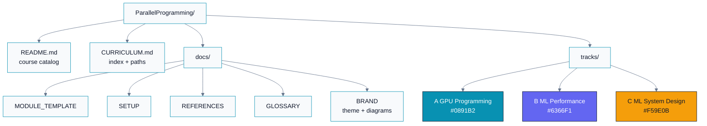
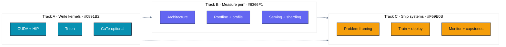
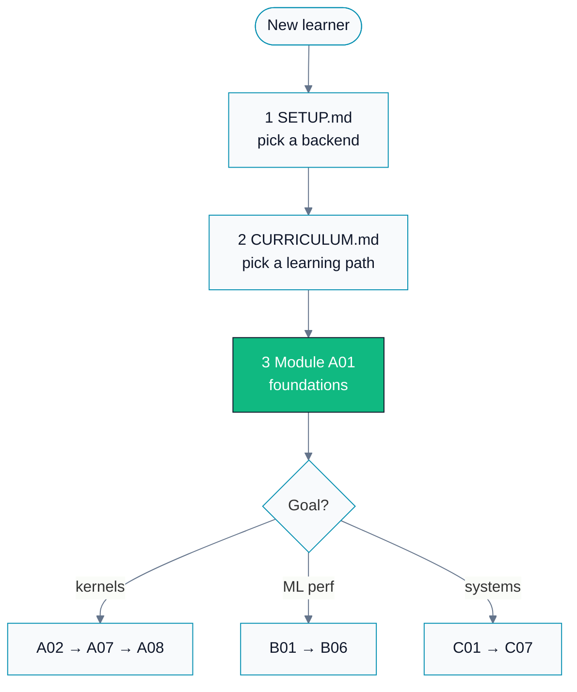

# GPU + ML Expert Tutor

> A hands-on, module-by-module curriculum that takes you from "what is a GPU thread"
> to "I can design, write, profile, and ship production ML systems on AMD and NVIDIA GPUs."

This repository is run in **expert tutor mode**. Every module is built to a single promise:

> **Explain it so a layman gets the intuition, then go deep enough that a Principal Engineer
> would nod along** — with runnable dual-vendor code, measured performance, cited research,
> and an honest account of the tradeoffs.

It is dual-track by design: examples run on **AMD (ROCm / HIP, `hipcc`, `gfx942`/MI300)** and
**NVIDIA (CUDA, `nvcc`)**, with a portable **Triton** track that runs on both. NVIDIA-only
advanced material (CuTe / CUTLASS / CuTile) is clearly marked optional.

---

## Who this is for

- Engineers preparing for **GPU kernel / ML performance / ML system-design** interviews.
- Practitioners who want first-principles depth, not copy-paste recipes.
- Anyone who wants to understand *why* a kernel is slow and *how* to make it fast — and prove it.

You need: comfort with C/C++ and Python, basic linear algebra, and curiosity. No prior GPU
experience is assumed — Module A01 starts from zero.

---

## How this repo is organized

Visual identity (colors, Mermaid styling, slide tokens): [docs/BRAND.md](docs/BRAND.md).

Each **module** is a self-contained folder with a `README.md` (9 fixed sections), `cuda/`,
`hip/`, and `triton/` code, a `Makefile`, and `exercises/` + `solutions/`. See
[docs/MODULE_TEMPLATE.md](docs/MODULE_TEMPLATE.md) for the exact structure.

---

## The three tracks

### Track A — GPU Programming Languages
Learn to *write* fast kernels. CUDA and HIP side by side, then Triton, then (optional) CuTe/CuTile.
Covers the programming model, memory hierarchy, the execution model, and the canonical parallel
patterns: **reduction, scan, tiled matmul, softmax, and fused attention**.

### Track B — GPU Understanding & ML Performance
Learn to *reason about* performance. Accelerator architecture (CDNA vs Hopper), the **roofline
model**, profiling with `rocprofv3` and Nsight, numeric precision, transformer performance,
**inference-serving optimizations** (continuous batching, paged attention, speculative decoding),
and **model sharding**.

### Track C — ML System Design
Learn to *architect* real systems. Problem framing and metrics, data pipelines, distributed
training, production model optimization (quantization, distillation, caching), deployment and
A/B testing, monitoring and drift, plus **end-to-end capstone case studies**.

A **Coding & Algorithms** interview thread (data structures, edge cases, clean code, plus GPU
parallel-algorithm drills) is woven into every module's Section 9 rather than living in a
separate track.

---

## Start here

1. Read [docs/SETUP.md](docs/SETUP.md) and get at least one backend working (`hipcc`, `nvcc`,
   or a Triton-capable Python environment).
2. Open [CURRICULUM.md](CURRICULUM.md), pick a learning path, and check the progress tracker.
3. Begin with
   [tracks/A-gpu-programming/A01.foundations-and-programming-model/](tracks/A-gpu-programming/A01.foundations-and-programming-model/).

If you only do one module first, do **A01** — it is the fully-built gold-standard reference for
every module that follows.

---

## Parallel programming models (background primer)

The GPU is one point in a larger landscape of parallelism. Keep these in your mental model:

| Model | What it is | Where it fits here |
|---|---|---|
| **OpenMP** | Compiler-directive shared-memory multithreading (CPU, and GPU offload). | Contrast with SIMT; used in `hipcc`/`nvcc` builds via `-fopenmp`. |
| **MPI** | Message passing across distributed-memory nodes. | Foundation for multi-node training (Track B07, C03). |
| **CUDA** | NVIDIA's GPGPU platform and API. | Track A, native NVIDIA path. |
| **HIP** | Portable C++ GPU API that compiles for AMD *and* NVIDIA. | Track A, AMD path (and portability story). |
| **Triton** | Python DSL that JIT-compiles fast GPU kernels for both vendors. | Track A08+, and every module's `triton/`. |

For more, see the official homes: [OpenMP](https://www.openmp.org/),
[MPI Forum](https://www.mpi-forum.org/), [CUDA Zone](https://developer.nvidia.com/cuda-zone),
[HIP](https://github.com/ROCm/HIP), [Triton](https://triton-lang.org/).

Video companion (system-design concepts for parallel programming):
[YouTube playlist](https://youtube.com/playlist?list=PLWyBQeJgIuzD2o9ZVw5oI-P2fX4uyNKZA&si=947INnGI2lcnDbJE).

---

## Conventions

- **Dual-vendor first.** If a concept differs between AMD and NVIDIA, both are shown and the
  difference is called out (e.g. 64-lane wavefront vs 32-lane warp).
- **Evidence over assertion.** Performance claims come with a command you can run and a number
  you can reproduce — never "this is faster, trust me."
- **Errors are always checked.** Every runtime call is wrapped (`HIP_CHECK` / `CUDA_CHECK`).
  Silent failure is treated as a bug, and Module A01 explains why.
- **Cite your sources.** Claims trace to a paper, a vendor doc, or a reputable blog. The master
  list lives in [docs/REFERENCES.md](docs/REFERENCES.md).

---

## License

See [LICENSE](LICENSE).
