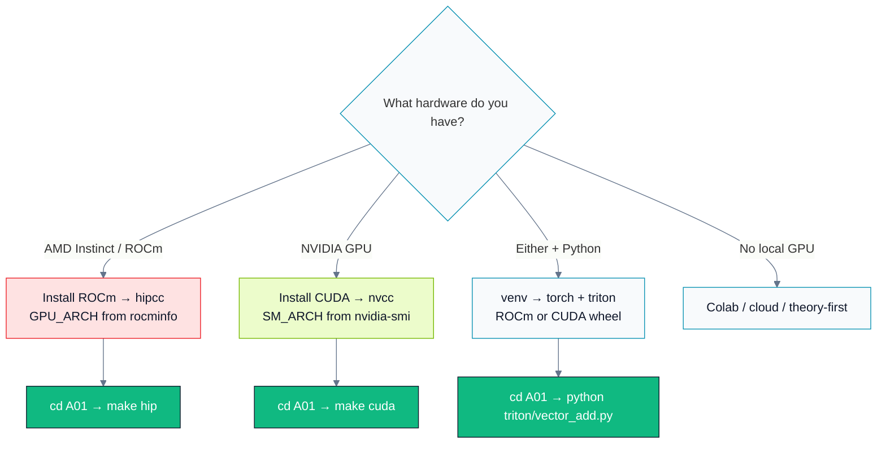

# Setup — ROCm (HIP), CUDA, and Triton

You need **at least one** backend working to do the labs. Ideally you have both an AMD and an
NVIDIA path so you can appreciate the portability story, but every module is designed so you can
complete it with a single vendor.



Brand colors for diagrams and slides: [BRAND.md](BRAND.md).

This repo's existing Makefiles assume **AMD ROCm** with `hipcc` and target `gfx942` (MI300). The
gold-standard module A01 also ships an `nvcc` path and a Triton path.

---

## 0. Check what you have

```bash
# AMD
rocminfo | grep -i "gfx"          # your GPU arch, e.g. gfx942
amd-smi list                      # or: rocm-smi
hipcc --version

# NVIDIA
nvidia-smi                        # driver + GPU
nvcc --version                    # CUDA toolkit

# Python (for Triton)
python3 --version                 # 3.9+ recommended
```

Find your GPU architecture string — you will pass it to the compiler:
- **AMD**: `gfx942` (MI300X/MI300A), `gfx90a` (MI200), `gfx1100` (RDNA3), etc. — from `rocminfo`.
- **NVIDIA**: compute capability, e.g. `sm_90` (Hopper), `sm_89` (Ada), `sm_80` (Ampere) — from
  the [CUDA GPU list](https://developer.nvidia.com/cuda-gpus) or `nvidia-smi --query-gpu=compute_cap --format=csv`.

---

## 1. AMD ROCm / HIP

Install ROCm following the official guide for your OS:
[ROCm installation](https://rocm.docs.amd.com/projects/install-on-linux/en/latest/).

Quick sanity check:

```bash
cd tracks/A-gpu-programming/A01.foundations-and-programming-model
make hip            # builds hip/ examples with hipcc
make run-hip        # runs them
```

The Makefiles default to `GPU_ARCH := gfx942`. Override for your card:

```bash
make hip GPU_ARCH=gfx90a
```

ROCm is Linux-first. On Windows, use **WSL2** with a supported GPU, or a Linux box / cloud node.

---

## 2. NVIDIA CUDA

Install the CUDA Toolkit: [CUDA downloads](https://developer.nvidia.com/cuda-downloads).
Verify `nvcc` is on your `PATH`.

```bash
cd tracks/A-gpu-programming/A01.foundations-and-programming-model
make cuda           # builds cuda/ examples with nvcc
make run-cuda
```

The Makefiles default to `SM_ARCH := sm_90` (Hopper). Override for your card:

```bash
make cuda SM_ARCH=sm_80     # Ampere (A100)
make cuda SM_ARCH=sm_89     # Ada (L40, RTX 4090)
```

> **HIP on NVIDIA:** HIP can also compile to CUDA (set `HIP_PLATFORM=nvidia`). The `hip/` code is
> therefore portable to NVIDIA too — but for clarity this curriculum keeps a native `cuda/` path.

---

## 3. Triton (both vendors)

Triton is a Python DSL that JIT-compiles GPU kernels. Use a virtual environment.

```bash
python3 -m venv .venv
source .venv/bin/activate           # Windows: .venv\Scripts\activate

# NVIDIA: triton ships with recent PyTorch, or:
pip install triton torch

# AMD (ROCm): install the ROCm build of PyTorch, which bundles Triton:
#   pip install torch --index-url https://download.pytorch.org/whl/rocm6.2
# See https://pytorch.org/get-started/locally/ for the current ROCm wheel index.
```

Sanity check:

```bash
cd tracks/A-gpu-programming/A01.foundations-and-programming-model
python triton/vector_add.py
```

Triton reference: [triton-lang.org](https://triton-lang.org/) ·
[tutorials](https://triton-lang.org/main/getting-started/tutorials/index.html).

---

## 4. Profilers

You will use these from Track B onward (and in A01's optional profiling lab):

- **AMD**: `rocprofv3` (systems + kernel tracing). Example:
  `rocprofv3 --summary --sys-trace --output-format csv -d out -- ./app.exe`
  Docs: [rocprofiler-sdk](https://rocm.docs.amd.com/projects/rocprofiler-sdk/en/latest/).
- **NVIDIA**: `nsys` (system timeline) and `ncu` (kernel-level counters). Example:
  `nsys profile ./app` then `ncu --set full ./app`.
  Docs: [Nsight Systems](https://docs.nvidia.com/nsight-systems/) ·
  [Nsight Compute](https://docs.nvidia.com/nsight-compute/).

---

## 5. No local GPU?

Options, roughly cheapest-first:
- **Google Colab / Kaggle** — free NVIDIA T4s; good enough for Triton and small CUDA labs.
- **Cloud instances** — AWS/GCP/Azure NVIDIA; AMD MI-series via select clouds.
- **Theory-first** — read Sections 1–3 and 6–9, and study the provided code + expected output;
  run the labs later when you have access.

---

## Troubleshooting

| Symptom | Likely cause | Fix |
|---|---|---|
| `hipcc: command not found` | ROCm not on PATH | `export PATH=/opt/rocm/bin:$PATH` |
| `no kernel image is available for execution` | wrong arch flag | set `GPU_ARCH`/`SM_ARCH` to your GPU |
| Triton `RuntimeError: ... no active driver` | no GPU visible / wrong torch build | check `torch.cuda.is_available()`; install the matching CUDA/ROCm wheel |
| kernel "runs" but output is garbage | missing error check / async error | wrap calls in `HIP_CHECK`/`CUDA_CHECK`, add a sync (see A01 §6) |
