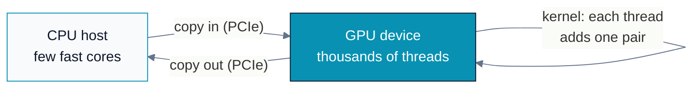
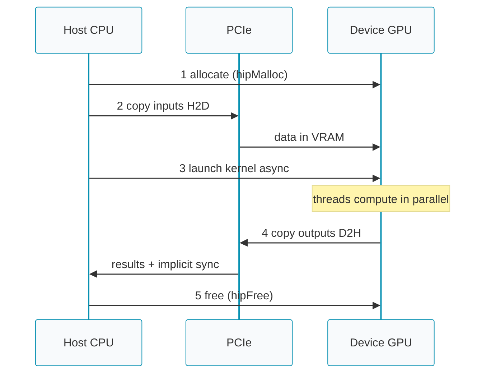
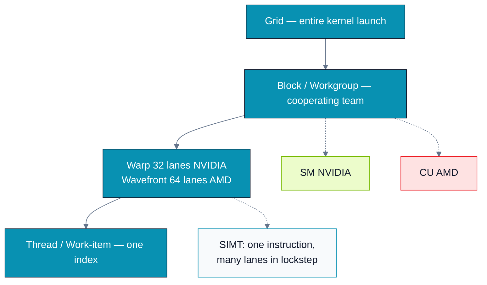
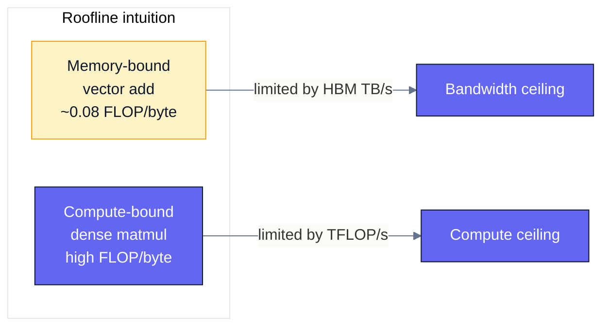
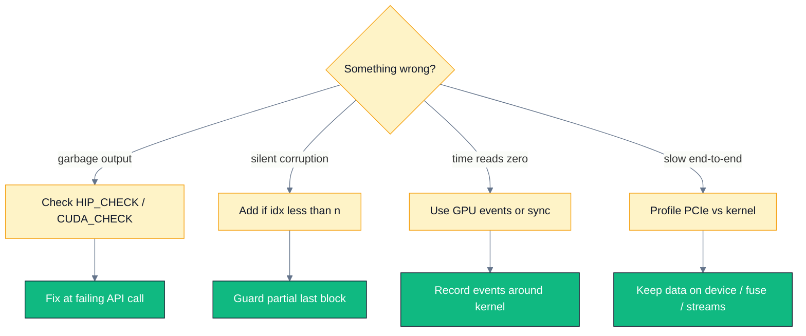

# A01 — Foundations & the GPU Programming Model

> Track A · Module 01 · Status: **DONE** (gold-standard reference module) · Est. 6 hours · Depth 1/5
>
> Prerequisites: comfort with C/C++ and a terminal. No GPU experience assumed.
> Backends: AMD (`hipcc`) · NVIDIA (`nvcc`) · Triton (Python). See [../../../docs/SETUP.md](../../../docs/SETUP.md).

---

## 1. TL;DR + Layman analogy

**TL;DR.** A GPU runs *one* program (a **kernel**) across *thousands* of threads at once. You, the
programmer, (1) copy data from CPU memory to GPU memory, (2) launch a kernel with a grid of threads,
(3) copy results back. Each thread computes its own global index and works on its slice of the data.
Getting this mental model right — and *always checking for errors* — is 80% of not shooting yourself
in the foot later.

**Layman analogy.** A **CPU is a few geniuses**; a **GPU is a stadium of 50,000 diligent students**.
If you ask the geniuses to add two huge lists of numbers, they'll do it fast but one pair at a time.
If you hand each student in the stadium *one* pair of numbers and shout "everyone, add your pair
*now*," the whole job finishes in a single moment. The catch: you have to (a) hand out the numbers
(copy data in), (b) give one clear instruction everyone follows (the kernel), and (c) collect the
answers (copy data out). The students are cheap and numerous but not clever individually — the art is
organizing the work so all 50,000 stay busy and none trip over each other.



**By the end of this module you can:** write, build, and run a correct GPU kernel on *both* AMD and
NVIDIA; explain grids/blocks/threads and how they map to hardware; check every runtime call;
measure kernel time and effective bandwidth; and spot the three classic beginner bugs (missing
bounds check, ignored errors, and the hidden PCIe transfer cost).

---

## 2. First Principles

### Why does the GPU exist at all?

Start from physics and economics, not from an API. A single CPU core spends most of its transistor
budget making *one* instruction stream fast: branch prediction, out-of-order execution, deep caches.
That is the right call when tasks are *different from each other* and *latency* matters.

But a huge class of problems is **embarrassingly parallel**: do the *same* arithmetic to millions of
independent data elements (add two vectors, multiply matrices, apply a nonlinearity to a tensor).
For those, spending transistors on cleverness-per-core is waste. You'd rather have *many* simple
cores and feed them from very wide memory. That is a GPU: throughput over latency.

### Derive the programming model from the problem

Take the simplest parallel problem: **C[i] = A[i] + B[i]** for `i = 0 .. N-1`.

- On a CPU you write a loop: `for (i) C[i] = A[i] + B[i];` — the loop *index* walks through the data.
- On a GPU you flip it inside out: launch `N` threads, and **each thread computes its own `i`** and
  does exactly one addition. There is no loop; the loop has become the *grid of threads*.

So the model must give each thread a way to know "who am I?" That's the whole trick:

```
global_index = block_id * threads_per_block + thread_id_within_block
```

Every GPU language spells this the same way (`blockIdx.x * blockDim.x + threadIdx.x`). This one line
maps a flat data array onto a 2-level hierarchy of threads.

### Why two levels (blocks *and* threads), not one flat pool?

Because hardware is physical. Threads that need to cooperate (share fast memory, synchronize) must
live on the *same* physical engine. So the model groups threads into **blocks** (a cooperating team,
scheduled onto one SM/CU) and groups blocks into a **grid** (the whole job). Threads in different
blocks *cannot* assume anything about each other's timing. This constraint is not arbitrary — it is
what lets the GPU scale from a laptop chip with 20 engines to a data-center chip with 300 by simply
running more blocks in parallel. **The same code scales because blocks are independent.**

### The non-negotiable host/device dance

The GPU has its *own* memory (VRAM/HBM), separate from CPU RAM. So every GPU program is:



```
1. allocate device memory            (hipMalloc / cudaMalloc)
2. copy inputs  host -> device       (hipMemcpy H2D)
3. launch kernel  <<<grid, block>>>  (runs asynchronously!)
4. copy outputs device -> host       (hipMemcpy D2H)   [this also synchronizes]
5. free device memory                (hipFree / cudaFree)
```

Miss step 2 and your kernel reads garbage. Forget that step 3 is *asynchronous* and you'll "time" a
kernel that hasn't run yet. These are the first bugs everyone hits — Section 6 makes them explicit.

---

## 3. Deep Dive

### The hierarchy, and how it maps to real silicon



| Software concept | NVIDIA term | AMD term | What it physically is |
|---|---|---|---|
| Whole launch | Grid | Grid | All threads for one kernel call |
| Cooperating team | Block | Workgroup | Threads on one SM/CU; share fast memory + barrier |
| Lockstep bundle | **Warp = 32 threads** | **Wavefront = 64 threads** | The true unit of execution |
| Physical engine | SM (Streaming Multiprocessor) | CU (Compute Unit) | Runs many warps/wavefronts concurrently |
| One lane | Thread | Work-item | One index, its own registers |

**The single most important AMD-vs-NVIDIA difference for this module:** the lockstep bundle is **64
lanes on AMD (wavefront)** and **32 lanes on NVIDIA (warp)**. Your block size should be a multiple
of this (multiples of 64 are safe on both). Pick 128 or 256 threads/block as a sane default and you
are aligned on either vendor.

### SIMT: how one instruction drives dozens of lanes

The hardware does **Single Instruction, Multiple Threads**. The scheduler fetches *one* instruction
and issues it to all lanes of a warp/wavefront simultaneously, each lane operating on its own data
and registers. This is why GPUs are so efficient: one expensive instruction-fetch amortized over
32–64 arithmetic operations.

The corollary — which we set up here and pay off in A03 — is **divergence**: if lanes in the same
warp take different `if` branches, the hardware must execute *both* branches serially, masking the
inactive lanes. So the bounds check `if (idx < n)` in a kernel is nearly free (only the last partial
warp diverges), but data-dependent branching inside hot loops can halve throughput.

### Why `if (idx < n)` is mandatory, not optional

You launch `ceil(N / blockDim.x)` blocks. Unless `N` is an exact multiple of the block size, the
**last block has extra threads** whose `idx >= N`. Without the guard, those threads write out of
bounds — a memory-corruption bug that may *look* like it works (the corruption is often silent).
This is the number-one beginner kernel bug. Every kernel that maps threads to a finite array needs
the guard:

```cpp
int idx = blockIdx.x * blockDim.x + threadIdx.x;
if (idx < n) { /* safe work */ }
```

### Occupancy, in one paragraph (full treatment in A03)

Each SM/CU can host many warps/wavefronts at once. When one warp stalls waiting on memory (hundreds
of cycles), the scheduler instantly runs another ready warp — this is how GPUs *hide latency*
instead of avoiding it. The fraction of the maximum resident warps you actually achieve is
**occupancy**, and it's capped by how many **registers** each thread uses and how much **shared
memory / LDS** each block uses. High occupancy is usually good, but not always the goal — we'll
quantify the tradeoff in A03. For now: prefer 128–256 threads/block and don't blow the register
budget.

### HIP ↔ CUDA: the same idea, two spellings

HIP is intentionally a near-mirror of CUDA, which is why one mental model serves both:

| CUDA | HIP | Meaning |
|---|---|---|
| `cudaMalloc` | `hipMalloc` | allocate device memory |
| `cudaMemcpy` | `hipMemcpy` | copy host↔device |
| `cudaDeviceSynchronize` | `hipDeviceSynchronize` | wait for GPU |
| `kernel<<<g,b>>>()` | `kernel<<<g,b>>>()` or `hipLaunchKernelGGL(...)` | launch |
| `cudaGetLastError` | `hipGetLastError` | fetch async launch error |

The triple-chevron `<<<grid, block>>>` launch syntax works in HIP too; `hipLaunchKernelGGL` is the
explicit macro form (see the legacy `03.hip_directives` example). This module's `hip/` code uses the
chevron form for symmetry with `cuda/`.

---

## 4. Hands-On Labs

All commands run from this module directory. Build for the vendor you have; the code is written so
the CUDA and HIP versions are line-for-line comparable.

```bash
# AMD
make hip            GPU_ARCH=gfx942     # build all hip/ programs
make run-hip                            # run them

# NVIDIA
make cuda           SM_ARCH=sm_90       # build all cuda/ programs
make run-cuda                           # run them

# Triton (either vendor, needs Python + torch/triton)
python triton/vector_add.py
```

### Lab 1 — Hello, thousands of threads (`hello`)

Files: [`hip/hello.cpp`](hip/hello.cpp) · [`cuda/hello.cu`](cuda/hello.cu).

Launch a grid where every thread prints its `(block, thread, global)` index.

**What to observe:** the print order is *not* sequential — the GPU runs blocks/warps in whatever
order it schedules them. This is your first, visceral proof that there is no guaranteed ordering
across threads. Never write code that assumes one.

### Lab 2 — Vector addition, done right (`vector_add`)

Files: [`hip/vector_add.cpp`](hip/vector_add.cpp) · [`cuda/vector_add.cu`](cuda/vector_add.cu) ·
[`triton/vector_add.py`](triton/vector_add.py).

This is the upgraded, production-grade version of the repo's original `02.vector_add`. Compared to
the legacy file it adds: **error checking on every call** (`HIP_CHECK`/`CUDA_CHECK`), a **CPU
reference check** (correctness proof), **event-based timing**, and an **effective-bandwidth**
report.

**What to observe:** the program prints `PASSED` (result matches CPU) and an effective bandwidth in
GB/s. Note the number — you'll compare it against the coalescing lab and against your GPU's peak
HBM bandwidth in Lab 3.

### Lab 3 — Coalescing: why *how* you read memory dominates (`coalescing`)

Files: [`hip/coalescing.cpp`](hip/coalescing.cpp) · [`cuda/coalescing.cu`](cuda/coalescing.cu).

Same amount of work, two access patterns:
- **Coalesced:** thread `i` reads element `i` (consecutive addresses within a warp).
- **Strided:** thread `i` reads element `i * STRIDE` (scattered addresses).

**What to observe:** the coalesced kernel achieves a large fraction of peak HBM bandwidth; the
strided kernel can be *several times slower* doing identical arithmetic. This is the single most
important performance lesson for memory-bound kernels, and it's the on-ramp to the roofline model
(Track B02). We measure it here so the idea is concrete before it's formalized.

### Lab 4 (optional) — Profile it

```bash
# AMD
make profile-hip        # rocprofv3 summary + traces into profiling_output/
# NVIDIA
make profile-cuda       # nsys timeline; then: ncu --set full ./cuda/vector_add.exe
```

**What to look for:** in the profiler, confirm the H2D/D2H copies often take *longer than the
kernel itself* for this tiny amount of arithmetic — the payoff for Section 6's "PCIe is the hidden
bottleneck" point.

---

## 5. Performance Analysis

The right question for *any* kernel is: **am I limited by compute or by memory?** Vector add tells
you immediately.

### The arithmetic-intensity argument

Vector add does, per element: read 8 bytes (`A[i]`, `B[i]`), one add (1 FLOP), write 4 bytes
(`C[i]`). That's **1 FLOP per 12 bytes**, an arithmetic intensity of ~0.083 FLOP/byte. A data-center
GPU delivers on the order of **hundreds of TFLOP/s** of compute but only a few **TB/s** of memory
bandwidth. The crossover (the roofline "ridge point") sits far to the right of 0.083. So vector add
is **hopelessly memory-bound** — its speed is decided entirely by bandwidth, and no amount of faster
math helps.



Vector add sits far left on the roofline — formal treatment in Track B02.

The kernel's *effective bandwidth* is:

```
effective_GBps = total_bytes_moved / kernel_time_seconds
             = (3 * N * sizeof(float)) / time      # 2 reads + 1 write per element
```

The `vector_add` program prints exactly this. Compare it to your GPU's peak (from `rocminfo` /
`nvidia-smi`, or the datasheet — e.g. MI300X ≈ 5.3 TB/s, H100 ≈ 3.35 TB/s HBM3). If you're getting a
healthy fraction of peak on the coalesced pattern, the kernel is doing about as well as it can.

### Representative shape of results

(Actual numbers depend on your GPU and `N`; run the labs to get yours. The *pattern* is the lesson.)

| Kernel | Access pattern | Effective BW | Verdict |
|---|---|---|---|
| `vector_add` | coalesced | large fraction of peak HBM | memory-bound, near-optimal |
| `coalescing` (stride 1) | coalesced | ~same as above | baseline |
| `coalescing` (stride 32) | strided | a fraction of the above | wasted bandwidth |

**Optimization delta to internalize:** switching from strided to coalesced access — *zero* change to
the math — is often a multiple-x speedup. Memory access pattern, not FLOPs, is the first lever for
memory-bound kernels.

---

## 6. Challenges, Drawbacks & Tradeoffs



### Pitfall 1 — Ignoring errors (the legacy code's real bug)

The repo's original `02.vector_add` assigns `hip_error = hipMalloc(...)` and then **never checks the
value**. If the allocation or copy fails, the program sails on and produces garbage or crashes far
from the real cause. GPU launch errors are worse: a kernel launch is *asynchronous*, so the error
surfaces later, at the next synchronizing call — not at the launch line. **Always** wrap runtime
calls and check launch errors explicitly:

```cpp
HIP_CHECK(hipMalloc(&d_A, bytes));
kernel<<<grid, block>>>(...);
HIP_CHECK(hipGetLastError());        // catches launch-config errors (e.g. too many threads)
HIP_CHECK(hipDeviceSynchronize());   // catches errors during execution
```

This module's `hip/check.h` and `cuda/check.cuh` provide these macros. Using them is not optional
style — it is the difference between a 2-minute fix and a 2-hour debugging session.

### Pitfall 2 — The missing bounds check

Covered in §3: without `if (idx < n)`, the last partial block writes out of bounds. Silent memory
corruption. Always guard.

### Pitfall 3 — Timing an async launch

`kernel<<<...>>>()` returns *immediately*, before the GPU finishes. If you read a CPU timer right
after the launch, you time nothing. Use **GPU events** (`hipEventRecord`/`cudaEventRecord`) around
the kernel, or a `hipDeviceSynchronize()` before stopping a CPU timer. The `vector_add` program uses
events, the correct approach.

### Pitfall 4 — PCIe is the hidden bottleneck

For this tiny workload, copying `A` and `B` to the device and `C` back over **PCIe** (tens of GB/s)
usually costs *more* than the kernel (HBM at TB/s + trivial math). The lesson generalizes: **data
movement, not computation, dominates** many real workloads. The fixes you'll meet later — keeping
data resident on the GPU, fusing kernels, overlapping copy with compute via streams — all attack
this. For now, just *see* it in the profiler (Lab 4).

### Tradeoffs to hold in mind

- **Block size:** too small underutilizes the SM/CU; too large can hurt occupancy via register
  pressure. 128–256 is a safe default; A03 shows how to tune it.
- **Portability vs native:** HIP buys you AMD+NVIDIA from one source, at the cost of occasionally
  trailing the very latest CUDA-only features. Triton buys you both vendors *and* far less code, at
  the cost of less control than hand-written C++.
- **When *not* to use a GPU at all:** tiny data (the copy overhead dominates), heavily branchy /
  pointer-chasing / inherently serial logic, or latency-critical single requests. GPUs win on
  *throughput over large, regular data*.

---

## 7. Real-World Use Cases

- **Elementwise tensor ops** in every deep-learning framework (add, scale, activation, dropout) are
  exactly this vector-add pattern, just fused and typed. When PyTorch runs `a + b` on CUDA/ROCm, it
  launches a kernel shaped like Lab 2.
- **Coalescing** (Lab 3) is why frameworks store tensors in contiguous, aligned layouts and why a
  transpose or a bad stride can tank performance — the same lesson at production scale.
- **The host/device dance and PCIe cost** motivate `pin_memory`, `non_blocking=True` transfers, and
  keeping activations on-device throughout training — standard practice in real pipelines.
- **The async-launch model** is the foundation of overlapping data loading with compute, the bread
  and butter of high-throughput training and inference loops.

Libraries embodying this module's ideas: PyTorch/JAX elementwise ops, Thrust/rocThrust,
CUB/hipCUB, and every custom Triton elementwise kernel you'll write in A08.

---

## 8. Cited References

Grounding for the claims above. Full list in [../../../docs/REFERENCES.md](../../../docs/REFERENCES.md).

- **CUDA C++ Programming Guide** — programming model, execution model, memory model.
  <https://docs.nvidia.com/cuda/cuda-c-programming-guide/index.html>
- **CUDA C++ Best Practices Guide** — coalescing, occupancy, async transfers, timing with events.
  <https://docs.nvidia.com/cuda/cuda-c-best-practices-guide/index.html>
- **HIP Programming Model** — HIP grid/block/thread model, `hipLaunchKernelGGL`.
  <https://rocm.docs.amd.com/projects/HIP/en/latest/understand/programming_model.html>
- **AMD CDNA architecture** — CU, wavefront (64), LDS, HBM bandwidth.
  <https://www.amd.com/en/technologies/cdna.html>
- Williams, Waterman, Patterson (2009). *Roofline* — the compute-vs-memory bound framing used in §5.
  <https://dl.acm.org/doi/10.1145/1498765.1498785>
- **Triton tutorials** — the vector-add kernel structure in `triton/vector_add.py`.
  <https://triton-lang.org/main/getting-started/tutorials/index.html>

---

## 9. Self-Assessment & Interview Drills

### Conceptual (answers below)

1. A kernel is launched with `blockDim.x = 256` and `N = 1000`. How many blocks do you launch, and
   how many threads have `idx >= N`? Why does that matter?
2. You launch a kernel and immediately read a CPU clock to time it. What's wrong, and how do you fix
   it?
3. Your teammate's kernel "works on my 32-lane NVIDIA GPU" but produces subtly wrong results on an
   AMD GPU. Name one warp/wavefront-size assumption that could cause this.
4. Explain to a non-programmer, in two sentences, why a GPU can be *slower* than a CPU for adding
   two 10-element arrays.

<details>
<summary>Answers</summary>

1. `ceil(1000/256) = 4` blocks → 1024 threads, so **24 threads have `idx >= N`**. Without
   `if (idx < n)` those 24 write out of bounds — silent corruption.
2. The launch is **asynchronous**; the CPU clock captures ~0 work. Fix: use GPU events around the
   kernel, or `hipDeviceSynchronize()`/`cudaDeviceSynchronize()` before stopping a CPU timer.
3. Any code that hard-codes 32 (e.g. a manual warp reduction using `__shfl` over 32 lanes, or
   assuming a block of 32 is exactly one lockstep bundle) breaks on a 64-lane wavefront. Portable
   code queries the warp/wavefront size or uses block sizes that are multiples of 64.
4. The GPU has to first ship the numbers across a slow bridge to its own memory and back, and it's
   built to win when there are *millions* of numbers, not ten — the setup costs more than the work.

</details>

### Coding & Algorithms drills

Do these in [`exercises/`](exercises/); reference answers in [`solutions/`](solutions/). Write real,
compiling, edge-case-correct code — no pseudo-code.

1. **SAXPY** (`exercises/01_saxpy.cpp`) — implement `Y[i] = a * X[i] + Y[i]` as a kernel, with the
   bounds guard, full error checking, and a CPU verification. This is the "hello world" of BLAS.
2. **Fix the race** (`exercises/02_race_condition.cpp`) — a histogram kernel increments shared
   counters with `bins[v]++` and gets wrong totals. Diagnose the data race and fix it correctly
   (hint: atomics). Prove the fix with a CPU reference count.
3. **Occupancy whiteboard** (`exercises/03_occupancy.md`) — given registers/thread, threads/block,
   and the SM/CU limits, compute how many blocks are resident and the resulting occupancy; then say
   which resource is the limiter and one way to raise occupancy.

### Stretch

- Port `vector_add` to Triton yourself and match the C++ effective bandwidth.
- Modify `coalescing` to sweep strides `{1,2,4,8,16,32}` and plot BW vs stride. Explain the shape
  using the warp/wavefront transaction size.
