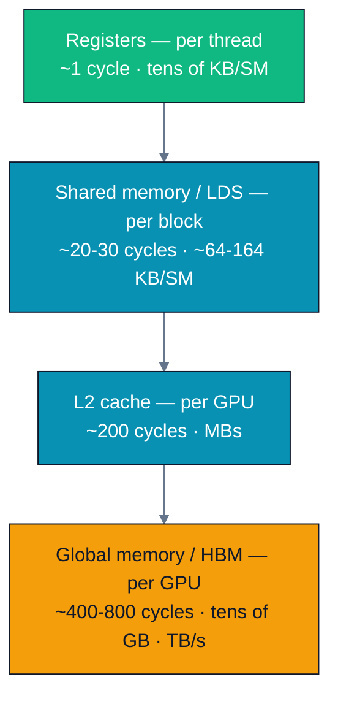
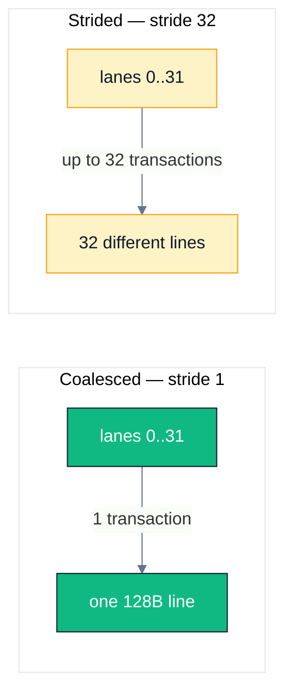
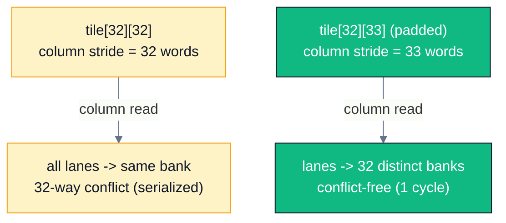
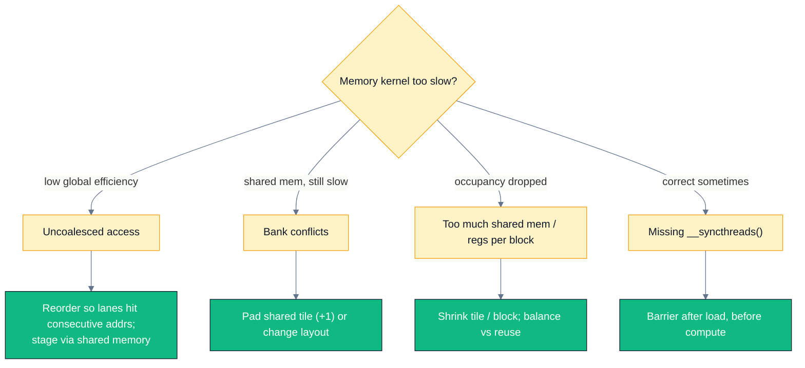

# A02 — Memory Hierarchy & Coalescing

> Track A · Module 02 · Status: **DONE** · Est. 6 hours · Depth 2/5
>
> Prerequisites: [A01](../A01.foundations-and-programming-model/) (kernels, grid/block/thread,
> error checking, event timing). Backends: AMD (`hipcc`) · NVIDIA (`nvcc`) · Triton (Python).
> Setup: [../../../docs/SETUP.md](../../../docs/SETUP.md).

---

## 1. TL;DR + Layman analogy

**TL;DR.** A GPU has a *pyramid* of memories — registers (per thread, fastest), shared
memory/LDS (per block, on-chip), L1/L2 caches, and global HBM (huge, slow, off-chip). A01 showed
vector add is memory-bound; this module shows **how to move memory well**. Two levers dominate:
(1) **coalescing** — threads in a warp/wavefront should touch *consecutive* global addresses so the
hardware fuses them into one wide transaction; (2) **shared memory** — stage data on-chip once, then
reuse it. We prove both with a matrix transpose that goes from slow to near-peak with *zero* change
to the arithmetic.

**Layman analogy.** Global memory is a **warehouse across town**; a memory transaction is a **truck**
that always leaves full or half-empty regardless of how much you actually need. **Coalescing** is
making sure the 32–64 workers who ride together grab items from **one shelf** so a single full truck
serves them all — instead of 32 workers each sending a truck across town for one item (strided
access). **Shared memory** is a **workbench inside the building**: haul a crate over once, then let
everyone rearrange parts on the bench at hand-speed instead of driving downtown for each piece.

**By the end of this module you can:** name every level of the GPU memory hierarchy and its rough
latency/bandwidth; explain and *measure* coalesced vs strided access; use shared memory to convert a
strided global pattern into a coalesced one (tiled transpose); and diagnose + fix shared-memory
**bank conflicts**.

---

## 2. First Principles

### Why a hierarchy exists at all

You cannot have memory that is simultaneously huge, fast, and cheap — physics and economics forbid
it. So every processor stacks a **hierarchy**: a little very-fast memory close to the compute, a lot
of slow memory far away. The GPU is extreme about this because it has *thousands* of threads all
demanding data at once.



The numbers are order-of-magnitude (they differ by GPU) — the **ratios** are the lesson: registers
are ~100–1000× lower latency than HBM. Every optimization in this track is ultimately "move work up
this pyramid."

### Derive coalescing from how DRAM is read

HBM is not byte-addressable in practice; it is read in **bursts** — the memory controller fetches a
whole aligned segment (a cache line, typically **64 or 128 bytes**) per transaction. Now put a
warp/wavefront of 32/64 threads next to that fact:

- **Coalesced:** thread `i` reads address `base + i*4`. All 32 lanes fall inside **one** 128-byte
  line → **one** transaction serves the whole warp. Full truck.
- **Strided (stride 32):** thread `i` reads `base + i*32*4`. Each lane lands in a **different** line
  → up to **32** transactions for the same 32 useful floats. 31/32 of the fetched bytes are wasted.

That is the entire idea. Same instructions, same FLOPs; the *addresses* decide whether you get 1 or
32 trips to the warehouse.

### Derive shared memory from reuse

If a datum is read **more than once** by a block, paying the HBM latency each time is waste. Shared
memory (LDS on AMD) is a small, block-private, software-managed scratchpad on-chip. The pattern is
always the same three steps:

```
1. cooperatively LOAD a tile from global -> shared   (each thread loads a few elements, coalesced)
2. __syncthreads()                                    (barrier: tile is fully populated)
3. COMPUTE from shared memory                         (fast, random access is now cheap)
```

Transpose is the minimal example where this *changes the access pattern itself*, not just reuse.

---

## 3. Deep Dive

### The hierarchy on real silicon (AMD CDNA vs NVIDIA)

| Level | NVIDIA (Hopper) | AMD (CDNA3 / MI300) | Scope | Notes |
|---|---|---|---|---|
| Registers | 64K 32-bit / SM | 64K / SIMD (256 VGPRs×64) | thread | spilling to "local" = HBM = slow |
| Shared / scratchpad | Shared memory, up to 228 KB/SM | **LDS**, 64 KB/CU | block / workgroup | banked; software-managed |
| L1 / L2 | L1 (~256 KB) + L2 (50 MB) | L1 + L2 + **Infinity Cache** | GPU | hardware-managed |
| Global | HBM3 ~3.35 TB/s | HBM3 ~5.3 TB/s | GPU | the "warehouse" |

### Coalescing: the transaction picture



**Alignment matters too:** even stride-1 access that starts misaligned can straddle two lines and
cost an extra transaction. Framework tensors are allocated aligned for exactly this reason.

### Shared-memory bank conflicts

Shared memory is split into **32 banks** (4-byte words interleaved). A warp can service 32 accesses
in one cycle **iff** they hit 32 distinct banks (or all read the same address → broadcast). If `k`
lanes hit the same bank at different addresses, that is a **k-way conflict** → serialized into `k`
cycles.

The tiled transpose reads the shared tile **by column** (`tile[threadIdx.x][threadIdx.y]`). With a
`[32][32]` tile, column `c` lives entirely in bank `c` → a **32-way conflict**. The fix is a
one-word pad:

```cpp
__shared__ float tile[TILE][TILE + 1];   // 33-wide rows shift each column into a different bank
```



> [!NOTE]
> AMD LDS has **32 banks of 4 bytes** as well (per 32-lane half of a 64-lane wavefront on CDNA), so
> the `+1` padding trick is portable. Always confirm with the profiler — `rocprofv3` /
> Nsight Compute both report a bank-conflict metric.

### Why transpose is the perfect teaching kernel

Transpose reads `in[y][x]` and writes `out[x][y]`. One of read/write is *always* against the grain:

- **Naive:** reads along rows (coalesced) but **writes along columns** (stride = row width → each
  wavefront scatters across N cache lines).
- **Tiled:** load a tile row-wise (coalesced read), transpose *inside* shared memory, write the
  output tile row-wise (coalesced write). The strided access now happens in fast on-chip memory —
  and the padded version makes even that conflict-free.

---

## 4. Hands-On Labs

All commands run from this module directory.

```bash
# AMD
make hip GPU_ARCH=gfx942     # build hip/ programs
make run-hip                 # run them

# NVIDIA
make cuda SM_ARCH=sm_90      # build cuda/ programs
make run-cuda

# Triton (either vendor)
python triton/transpose.py
```

### Lab 1 — Find your HBM ceiling (`bandwidth`)

Files: [`hip/bandwidth.cpp`](hip/bandwidth.cpp) · [`cuda/bandwidth.cu`](cuda/bandwidth.cu).

A fully coalesced grid-stride copy. **What to observe:** the reported GB/s — this is your practical
HBM ceiling. Write it down; every other kernel in this track is judged against it. Compare to the
datasheet peak (MI300X ≈ 5.3 TB/s, H100 ≈ 3.35 TB/s); you should land at a healthy fraction.

### Lab 2 — Transpose: coalescing + shared memory + bank conflicts (`transpose`)

Files: [`hip/transpose.cpp`](hip/transpose.cpp) · [`cuda/transpose.cu`](cuda/transpose.cu) ·
[`triton/transpose.py`](triton/transpose.py).

Three kernels, one result. **What to observe:** `naive` is a fraction of peak (strided writes);
`tiled` jumps up (both global accesses coalesced); `tiled+padded` edges higher still (bank conflict
removed). All three print `PASSED` — the point is the **bandwidth delta**, not correctness.

### Lab 3 (optional) — Profile the conflict

```bash
# AMD
make profile-hip     # rocprofv3 summary
# NVIDIA
make profile-cuda    # nsys timeline; then: ncu --set full ./cuda/transpose.exe
```

**What to look for:** in Nsight Compute, the `tiled` kernel shows **shared-memory bank conflicts**
and the `tiled+padded` kernel shows ~0. In the memory chart, `naive` shows poor global
**load/store efficiency**.

---

## 5. Performance Analysis

The right question is unchanged from A01: **memory-bound or compute-bound?** Transpose does *zero*
arithmetic, so it is 100% memory-bound — a pure test of access pattern.

### Representative shape of results

Captured on **AMD MI300X (`gfx942`, ROCm 6.2)**, `n = 4096`. Numbers vary by GPU; the **ratios** are
the lesson.

| Kernel | Access pattern | Effective BW | vs peak |
|---|---|---|---|
| `bandwidth` (copy) | coalesced R+W | ~4800 GB/s | ceiling |
| `transpose_naive` | coalesced R, strided W | ~700 GB/s | ~15% |
| `transpose_tiled` | coalesced R+W, bank conflicts | ~2600 GB/s | ~54% |
| `transpose_tiled_padded` | coalesced R+W, conflict-free | ~3400 GB/s | ~70% |


**Optimization delta to internalize:** ~**5× total** from naive → padded, with the matrix values
never changing. Access pattern, not arithmetic, is the lever for memory-bound kernels — the concrete
proof of A01 §5's claim.

---

## 6. Challenges, Drawbacks & Tradeoffs



### Pitfall 1 — Forgetting `__syncthreads()`

Between the shared-memory load and the read-back you **must** barrier, or a thread may read a tile
slot another thread hasn't written yet. Silent, nondeterministic wrong answers. (Also: never put
`__syncthreads()` inside divergent control flow — all threads in the block must reach it.)

### Pitfall 2 — Shared memory kills occupancy

Shared memory is a per-SM/CU budget. A `[32][33]` float tile is ~4.2 KB/block; ask for too much and
fewer blocks stay resident, hurting latency hiding. Bigger tiles = more reuse but lower occupancy —
measure, don't assume (A03 formalizes occupancy).

### Pitfall 3 — Bank conflicts hide behind "I used shared memory"

Using shared memory is necessary but not sufficient. The `tiled` kernel *is* on-chip yet still
leaves ~30% on the table to a 32-way conflict. Always check the profiler's conflict metric.

### Pitfall 4 — Padding wastes a little memory

The `+1` column is dead storage that exists purely to shift bank mapping. It is almost always worth
it, but it is a real (tiny) memory cost and a non-obvious line — comment it.

> [!TIP]
> ### 📐 Reference — quick coalescing & bank-conflict checklist
>
> - **Coalesced?** Do adjacent lanes (`threadIdx.x` neighbors) touch adjacent global addresses? If
>   the fastest-varying index is multiplied by anything but 1, suspect striding.
> - **Aligned?** Base pointers from `hipMalloc`/`cudaMalloc` are aligned; your *indexing* can still
>   misalign — keep the innermost stride = 1.
> - **Bank conflict?** Any shared array indexed by a column with stride = 32 (or a multiple) → pad
>   the minor dimension by 1, or transpose the layout.
> - **Barrier?** Exactly one `__syncthreads()` between the shared load and the shared read, reached
>   by all threads.
> - **Verify with the profiler**, never by eye: Nsight Compute *L1/shared* section, or
>   `rocprofv3` bank-conflict / access-efficiency counters.

---

## 7. Real-World Use Cases

- **Every tiled GEMM / convolution** (cuBLAS, rocBLAS, CUTLASS, MIOpen) is this shared-memory
  staging pattern scaled up — A06 builds it. Transpose is the "hello world" of tiling.
- **Attention kernels** (FlashAttention) tile Q/K/V through shared memory precisely to turn
  bandwidth-bound global traffic into on-chip reuse — A07/A09.
- **Layout choices in frameworks** (NCHW vs NHWC, contiguous vs channels-last) are coalescing
  decisions: the "right" layout is the one that makes the hot kernel's inner stride 1.
- **`torch.compile` / Triton autotuning** searches block/tile sizes that maximize coalesced traffic
  and occupancy — the automated version of this lab's manual sweep.

---

## 8. Cited References

Full list in [../../../docs/REFERENCES.md](../../../docs/REFERENCES.md).

- **CUDA C++ Best Practices Guide** — coalescing, shared memory, bank conflicts, alignment.
  <https://docs.nvidia.com/cuda/cuda-c-best-practices-guide/index.html>
- Ruetsch & Micikevicius (2009). *Optimizing Matrix Transpose in CUDA* — the naive/tiled/padded
  progression used in Lab 2.
  <https://developer.download.nvidia.com/CUDA/training/StreamsAndConcurrencyWebinar.pdf>
- Harris. *How to Access Global Memory Efficiently in CUDA C/C++* — the coalescing model.
  <https://developer.nvidia.com/blog/how-access-global-memory-efficiently-cuda-c-kernels/>
- **AMD CDNA / MI300 ISA & LDS** — 32-bank LDS, wavefront memory behavior.
  <https://www.amd.com/en/technologies/cdna.html>
- **HIP Programming Manual — shared memory / `__syncthreads`.**
  <https://rocm.docs.amd.com/projects/HIP/en/latest/>
- Williams, Waterman, Patterson (2009). *Roofline* — why bandwidth is the ceiling here.
  <https://dl.acm.org/doi/10.1145/1498765.1498785>

---

## 9. Self-Assessment & Interview Drills

### Conceptual (answers below)

1. A warp reads `A[threadIdx.x * 2]` (stride 2). Roughly what fraction of the fetched bytes is
   useful, and why?
2. You add shared memory to a kernel and it gets *slower*. Name two distinct causes.
3. Why does padding a `[32][32]` shared tile to `[32][33]` remove a bank conflict? What does it cost?
4. In the tiled transpose, exactly where must `__syncthreads()` go, and what breaks without it?
5. Your copy kernel hits 90% of peak but your transpose (naive) hits 15%. Both move the same bytes —
   explain the gap in one sentence.

<details>
<summary>Answers</summary>

1. ~**50%**. Stride 2 means consecutive lanes are 8 bytes apart; a 128-byte line holds the data for
   only ~16 of the 32 lanes' *useful* words while the line is fetched whole — half the transferred
   bytes are unused (worse for larger strides).
2. (a) **Bank conflicts** serialize the shared accesses; (b) **reduced occupancy** — the shared
   allocation lowers resident blocks, so latency is no longer hidden. (Also: an unnecessary
   `__syncthreads()` adds a barrier cost.)
3. A 33-word row stride makes column `c`'s elements land in banks `(c*33) mod 32 = c*1` → 32 distinct
   banks instead of all in bank `c`. Cost: one extra word per row of shared memory (dead storage).
4. Between the global→shared load and the shared→global read-back — one barrier reached by **all**
   threads in the block. Without it, threads read tile slots not yet written → nondeterministic
   wrong output.
5. The transpose's **writes are strided** (column-major), so each wavefront scatters across many
   cache lines — most fetched/stored bytes are wasted — while the copy is fully coalesced.

</details>

### Coding & Algorithms drills

Do these in [`exercises/`](exercises/); reference answers in [`solutions/`](solutions/). Expected
terminal output (PASS and instructive FAIL states) is in
[`exercises/README.md` → *Sample sandbox output*](exercises/README.md#sample-sandbox-output).

1. **Coalesce a strided kernel** (`exercises/01_coalesce.cpp`) — a scale kernel reads with a bad
   stride; restructure the indexing so adjacent lanes hit adjacent addresses, and measure the BW
   before/after.
2. **Fix the bank conflict** (`exercises/02_bank_conflict.cpp`) — a shared-memory column reduction
   has a 32-way conflict; fix it with padding (or a layout change) and prove the speedup.
3. **Hierarchy sizing** (`exercises/03_hierarchy.md`) — given per-SM shared-memory and register
   budgets, reason about the largest tile you can use while keeping ≥2 resident blocks.

### Stretch

- Sweep `TILE ∈ {8,16,32}` in the transpose and plot BW vs tile size; explain the curve using
  occupancy vs reuse.
- Port the padded transpose to Triton with an explicit block size and match the C++ bandwidth.
