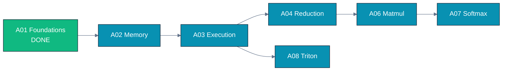

# Track A — GPU Programming Languages

Learn to **write** fast GPU kernels, CUDA and HIP side by side, then Triton, then (optionally)
CuTe/CuTile. You will build the canonical parallel patterns from scratch and understand why the
fast version is fast.

## Modules

| ID | Module | Status |
|----|--------|--------|
| [A01](A01.foundations-and-programming-model/) | Foundations & programming model | **DONE** |
| A02 | Memory hierarchy & coalescing | planned |
| A03 | Execution model: warps/wavefronts, occupancy, divergence | planned |
| A04 | Parallel reduction (7-stage optimization) | planned |
| A05 | Parallel scan / prefix sum | planned |
| A06 | Tiled matmul | planned |
| A07 | Softmax & fused kernels | planned |
| A08 | Triton foundations | planned |
| A09 | Advanced Triton (FlashAttention-style) | planned |
| A10 | CuTe / CUTLASS / CuTile (NVIDIA-only, optional) | planned |

See the top-level [CURRICULUM.md](../../CURRICULUM.md) for the dependency graph and learning paths.

## Legacy raw examples

The folders `01.hello_world/`, `02.vector_add/`, and `03.hip_directives/` are the original
hand-written examples this repository started from. They are kept as raw reference material and are
being progressively refactored into the structured module format. **Start with `A01`**, which
absorbs and upgrades the hello-world and vector-add material into the full 9-section template
(with error checking, a CUDA path, a Triton path, profiling, and drills).
