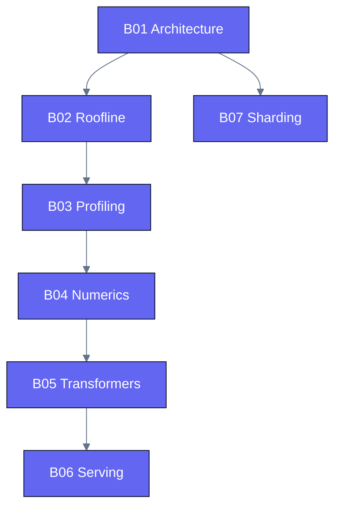

# Track B — GPU Understanding & ML Performance

Learn to **reason about** performance: what makes a kernel or a model fast or slow, and how to
prove it with measurements. This track turns you from someone who writes kernels into someone who
can diagnose and defend performance decisions.

## Modules

| ID | Module | Status |
|----|--------|--------|
| B01 | Accelerator architecture (CDNA vs Hopper) | planned |
| B02 | Roofline model & arithmetic intensity | planned |
| B03 | Profiling (`rocprofv3` / Nsight) | planned |
| B04 | Precision & numerics (fp32→fp8, quantization) | planned |
| B05 | Transformer architecture from a perf lens | planned |
| B06 | Inference serving optimizations | planned |
| B07 | Model sharding & distributed | planned |

Prerequisite: Track A01 for GPU literacy. See [CURRICULUM.md](../../CURRICULUM.md) for details.

Modules are built just-in-time; folders appear as they are authored.
